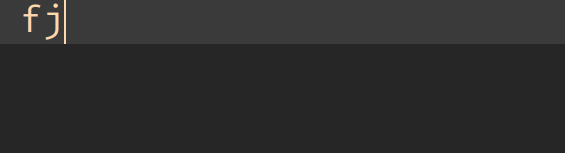
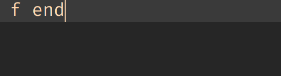
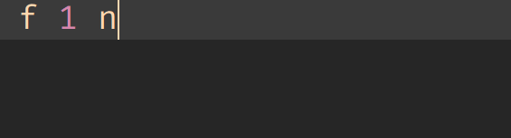
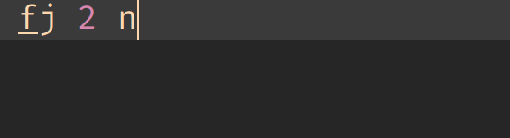
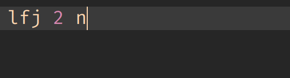
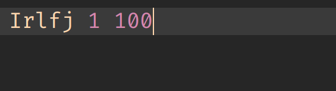
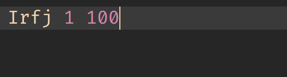

## 触发键的说明 !important

如果你使用的是[RainboyVim](https://github.com/Rainboylvx/RainboyVim)这个配置，那么触发的按键是**<kbd>tab</kbd>**，如果不，那么就是你设置的`UltiSnips`触发的键。

## 目录

 - [安装](#安装)
 - [语法](#语法)
   - [for 循环](#for-循环)
基础
    语法
    条件
    输入输出
    循环
算法
数据结构
数学
工具

## 安装

基于:

- vim/neovim
- [vim-plug](https://github.com/junegunn/vim-plug)
  - 其他的vim插件管理插件,例如[Vundle.vim](https://github.com/VundleVim/Vundle.vim)
- [UltiSnips](https://github.com/SirVer/ultisnips)

vim中配置,具体查看[vim-plug](https://github.com/junegunn/vim-plug#example)中的配置方法

```
Plug 'SirVer/ultisnips'
Plug 'Rainboylvx/rSnip'
```

安装
```
:PlugInstall
```

## 语法

### 基础

`if<tab>`  ===>

```c
if( {1} ) {
    {2}
}
```

`lif<tab>` ===>

```base
if( {1} ) {2}
```

`ei`
```c
else if( {1} ) {
    {2}
}
```

`lei` 
```
else if( {1} ) {2}
```

`el`

```c
else {
    {1}
}
```

`lel` ==>  `else `

`wh`

```c
while( {1} ){
    {2}
}
```

`lwh` ===>`while( {1} ) {2};`

`do`

```c
do {
    {1}
}while( {2} )
```

`sw`

```c
switch( {1} ){
    case {2} :
        {3}
        break;
    default:
        break;
}
```


### 输入输出

printf

`pr`
`prn`


 - scanf
 - read
 - out

### 调试

 - DD
 - dd
 - db
 - debug
 - debug_info

### 变量定义

int
i(\d)

常用函数/工具

mem
double_max
inf (1<<30)
st
function F
sct
ct


二进制的输出

### for 循环

for 循环这里最复杂触发，最简单的使用：输入一个`f`(后面可以有无限的空格，下同)，


`f[循环变量名]`可以设定循环变量名



`f [循环结束]`



`f [循环开始] [循环结束]`



`f[循环变量名] [循环开始] [循环结束]`



单行for，`lf[循环变量名] [循环开始] [循环结束]`



其它的标记

 - `I` 在for的`()`不使用int
 - `r` r=reverse 反向，例如`fi 1 n` ==>
     ```
     for(i=n;i>=1;--i){

     }
     ```
 - `l` l=line 单行for，例如`lf x` => `for(i=1;i<=x;++i)`

这些标记是可选的，放在`f`的前边。

| 触发                       | 结果                        |
|----------------------------|-----------------------------|
| <kbd>[I][r][l]f</kbd>      | `for([int] i=1; i<=n; ++i)` |
| <kbd>[I][r][l]f n</kbd>    | `for([int] i=1; i<=N; ++i)` |
| <kbd>[I][r][l]f s n</kbd>  | `for([int] i=S; i<=N; ++i)` |
| <kbd>[I][r][l]fj s n</kbd> | `for([int] j=s; i<=N; ++j)` |


例子：使用 `I`，`r` 标记的`lf`，会创建一个单行的反向`for`，且会使用`int`,



例子：同上，只是没有使用`l`标记




## 算法

| id | 触发                  | 说明                 |
|----|-----------------------|----------------------|
| 1  | <kbd>lca-tarjan</kbd> | tarjan求lca,离线法   |
| 2  | <kbd>lca-doubly</kbd> | 树上倍增求lca,在线法 |
| 3  | <kbd>dfs-seq</kbd>    | ...                  |
 

## 数据结构

| id | 触发                       | 说明                       |
|----|----------------------------|----------------------------|
| 1  | <kbd>linkList</kbd>        | 链式前向星                 |
| 2  | <kbd>unionfind</kbd>       | 并查集                     |
| 3  | <kbd>rmq</kbd>             | rmq                        |
| 4  | <kbd>bit</kbd>             | 树状数组                   |
| 5  | <kbd>bit_range_point</kbd> | 树状数组 区间修改 单点查询 |
| 6  | <kbd>bit_range_range</kbd> | 树状数组 区间修改 区间查询 |
| 7  | <kbd>bit_max</kbd>         | 树状数组 区间最值          |
| 8  | <kbd>bit_2D</kbd>          | 树状数组 二维              |
| 9  | <kbd>sgt_point</kbd>       | 线段树 单点更新 区间查询   |

